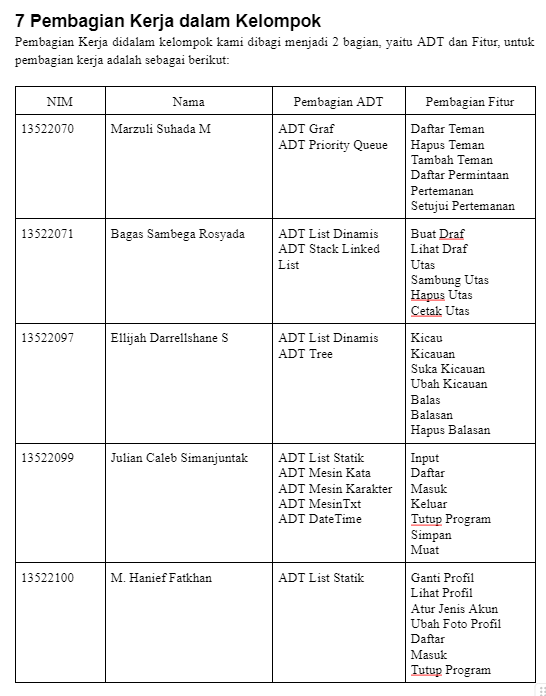
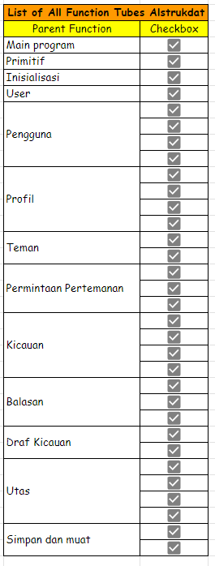

# Tugas Besar IF2110 Algoritma dan Struktur Data

## Members
1. Marzuli Suhada M (13522070)
2. Bagas Sambega Rosyada (13522071)
3. Ellijah Darrellshane S (13522097)
4. Julian Caleb Simanjuntak (13522099)
5. M. Hanief Fatkhan N. (13522100)

## Penjelasan Singkat
Tubes Alstrukdat ini berisi sebuah program simulasi media sosial bernama Burbir yang berbasis CLI (command-line interface), dibuat dalam bahasa C dengan menggunakan beragam struktur data. Program dikompilasi menggunakan Makefile dan wajib dapat dikompilasi dan dijalankan pada sistem operasi berbasis UNIX (Program ini dapat dijalankan melalui WSL).

## Cara Menjalankan Program
1. Gunakan terminal WSL
2. Masuk ke folder src
```
cd src
```
3. Jalankan program melalui Makefile dengan syntax berikut
```
make run
```

## Pembagian Tugas


## Daftar Fitur dan Status Pengerjaan



